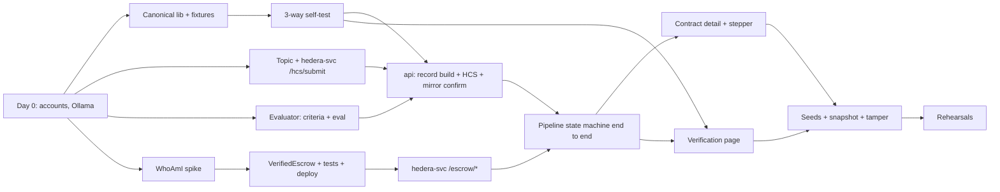

# Implementation Plan — Verified-Then-Paid Escrow

*Implementation Plan · v1.0 · 26 Sep 2026 · Owner: Hedi (solo)*
*Builds against `01-PRD.md`, `02-TRD.md`, `03-APP-FLOW.md`, `04-BACKEND-SCHEMA.md`.*

---

## 1. Timeline at a glance

| Date | Day | Theme | End-of-day gate (must be true before sleeping) |
| --- | --- | --- | --- |
| Sat 26 Sep | Day 0 (evening) | Accounts and tooling | 4 funded ECDSA testnet accounts; Ollama model pulled |
| Sun 27 Sep | **Day 1** | Trust core: hashing + HCS + evaluator | Three-way hash self-test passes; one real record on HCS, confirmed via mirror node, from a real Ollama verdict |
| Mon 28 Sep | **Day 2** | Contract + full pipeline | Deliverable → verdict → HCS → `submitVerdict` → HBAR released on testnet, driven by `api` |
| Tue 29 Sep | **Day 3** | Frontend + verification page | Full demo click path works in the browser, including tamper → red MISMATCH |
| Wed 30 Sep | Prep session | Validate with organisers; P1 items | Open questions answered; seeds + snapshot created |
| Thu 1 Oct | Polish | Hardening, P1 features, pitch deck | 3 clean rehearsals |
| Fri 2 Oct | Rehearse | Freeze code, backup recording | 5 clean rehearsals; code frozen at 18:00 |
| Sat 3 Oct | Hackathon | Present | — |

Assumed capacity: about 10 focused hours on each of Days 1–3, and about 6 hours on each of 30 Sep–2 Oct. Estimates below include debugging slack.

## 2. Critical path

**The three things that can sink the project, all de-risked by Day 1 noon:**

1. hash drift between languages (T1.3)
2. `msg.sender` and value units on Hedera EVM (T1.6)
3. local model output quality (T1.8)

## 3. Day 0 — Sat 26 Sep evening (≈ 2 h)

| ID | Task | Est | Done when |
| --- | --- | --- | --- |
| T0.1 | Create 4 **ECDSA** testnet accounts in Hedera Portal (oracle, client, freelancer, arbitrator); fund from faucet | 40m | All visible on HashScan with EVM aliases; oracle ≥ 150 ℏ, client ≥ 200 ℏ |
| T0.2 | `ollama pull qwen2.5:7b-instruct`; run one JSON-schema `format` call from curl | 20m | Returns valid JSON in < 30 s |
| T0.3 | Repo skeleton per TRD §13; `docker-compose.yml` with Postgres 16; pnpm workspace (`web`, `hedera-svc`, `packages/canonical`, `contracts`) | 40m | `docker compose up db` works; `pnpm -r install` clean |
| T0.4 | Write `.env` files from TRD §12; add them to `.gitignore` | 10m | `git status` shows no `.env` |

If faucet limits block funding, ask in the bootcamp channel tonight. Don't discover this on Day 2.

## 4. Day 1 — Sun 27 Sep: the trust core (≈ 10 h)

**Morning — de-risk (must finish by ~13:00)**

| ID | Task | Est | Done when |
| --- | --- | --- | --- |
| T1.1 | `packages/canonical`: `canonicalString`, `recordHash`, `normalize` (TRD §5.3) + vitest | 45m | Unit tests pass |
| T1.2 | `api/app/services/canonical.py` + pytest; write the 6 fixtures in `fixtures/canonical/` (ASCII, French, Arabic, emoji, quotes/backslash/tab, control chars) with hashes generated by Python | 45m | pytest passes |
| T1.3 | **Three-way self-test:** vitest reads the same fixtures; minimal `web/app/dev/selftest` page hashes them in the browser; plus one standalone scratch script (`scripts/scratch_hash.py` using `hashlib` on the raw bytes) | 45m | **All three agree on all 6 fixtures — hard gate** |
| T1.4 | `contracts/scripts/create-topic.ts`: topic with submit key = oracle key, memo per TRD §6; write the topic ID to `shared/deployment.json` | 30m | Topic on HashScan with submit key shown |
| T1.5 | `hedera-svc`: Express skeleton, token middleware, `POST /hcs/submit` (chunked, `setMaxChunks(20)`), `GET /balances` | 1h | Posting a 3 KB fixture record returns sequence numbers; visible on HashScan |
| T1.6 | **WhoAmI spike** (TRD §7.4): deploy via Hardhat → call `whoami()` and `echoValue{value: parseEther("1")}` from `ethers` | 30m | `msg.sender` == oracle EVM alias; value reads `100000000` |

**Afternoon — evaluator and anchoring**

| ID | Task | Est | Done when |
| --- | --- | --- | --- |
| T1.7 | `api` skeleton: FastAPI app, config, SQLAlchemy models + Alembic `0001_initial` (Schema doc §4, including the view) | 1h15 | `alembic upgrade head` creates all tables + view |
| T1.8 | `services/evaluator.py`: criteria extraction + evaluation prompts (TRD §8.2), JSON schemas, Pydantic validation, 2 retries, deterministic aggregation (TRD §8.3), `model_version` from `/api/tags`, warm-up call | 2h | Returns a correct verdict on the S1 (pass) and S2 (fail) texts from Schema doc §8.2 |
| T1.9 | Evaluator mini-suite `tests/eval_suite.py`: 6 pairs (3 pass, 3 fail, including the S3 injection) | 45m | ≥ 5/6 correct and the injection is flagged. If not, tune prompts now, not on Day 3 |
| T1.10 | `services/mirror.py`: poll + chunk reassembly + hash check (TRD §6.1) | 45m | Confirms the T1.5 message by hash |
| T1.11 | Script `scripts/day1_e2e.py`: hard-coded SOW + deliverable → evaluator → canonical record → `/hcs/submit` → mirror confirm → print HashScan link | 45m | **Day 1 gate:** a real AI verdict record on HCS, hash-confirmed |

**Day 1 slip rule:** if T1.8 runs long, skip T1.9's full suite and keep only S1/S2/S3. Never skip T1.3 or T1.11.

## 5. Day 2 — Mon 28 Sep: contract + full pipeline (≈ 10 h)

| ID | Task | Est | Done when |
| --- | --- | --- | --- |
| T2.1 | `VerifiedEscrow.sol` exactly as in TRD §7.1 | 45m | Compiles |
| T2.2 | Hardhat tests (TRD §7.2), all 7 cases | 1h15 | `npx hardhat test` green |
| T2.3 | `scripts/deploy.ts` to testnet; write address + ABI to `shared/deployment.json` | 30m | Contract visible on HashScan |
| T2.4 | `hedera-svc` `/escrow/create`, `/escrow/verdict`, `/escrow/resolve`, `GET /escrow/:id`. Per-persona `ethers.Wallet`s, explicit `gasLimit`, event parsing | 1h30 | Manual curl: create → verdict(pass) releases; create → verdict(fail) → resolve(refund) refunds |
| T2.5 | `api/services/hedera_client.py`: typed httpx client for `hedera-svc` | 30m | Used by the routers |
| T2.6 | Routers `personas`, `contracts` (create, fund, list, get), `verify` per Schema doc §5 | 1h30 | Contract can be created and funded via HTTP |
| T2.7 | `services/pipeline.py`: state machine (TRD §9), per-step DB transactions (Schema doc §7), hashing from `v_canonical_record`, row lock, resume-on-startup, `ERROR` + retry | 2h | `POST /deliverable` on a funded contract ends in `RELEASED` or `HELD` with all rows populated |
| T2.8 | `resolve`, `retry`, `evaluation` endpoints + visibility gating (FR-11) | 45m | Arbitrator resolves a HELD contract via HTTP |
| T2.9 | `GET /health` covering all 4 dependencies | 15m | Returns ok/down per dependency |

**Day 2 gate:** the whole business flow runs from HTTP calls alone (curl or a `.http` file), with HashScan links for funding, HCS and the verdict.

**Day 2 slip rule (spec §15 fallback):** if the contract isn't released-on-testnet by 17:00, switch `SUBMITTING_VERDICT` to a direct HBAR `TransferTransaction` from an oracle-held escrow account. Keep the contract code in the repo, and move on to Day 3 on time. Frontend time is not negotiable, because the verification page is the demo.

## 6. Day 3 — Tue 29 Sep: frontend + verification (≈ 10 h)

Build in this order. The verification page comes **second**, not last (spec §10 build priority).

| ID | Task | Est | Done when |
| --- | --- | --- | --- |
| T3.1 | Next.js layout: nav, persona switcher (cookie + `X-Persona`), health footer, HashScan pill component, status badge (App Flow §2, §5.1) | 1h15 | Switching persona changes nav + balances |
| T3.2 | **`/verify` + `/verify/[id]`**: browser mirror-node fetch + reassembly (`packages/canonical/hcs.ts`), browser hashing, loading checklist, MATCH/MISMATCH banners, field diff, evidence panel, all edge states (App Flow §5.6). Check mirror-node CORS first | 2h | On a pipeline-created contract: green. After a manual `UPDATE`: red with the correct fields highlighted |
| T3.3 | Dashboard with filters and empty states (App Flow §5.1) | 45m | Lists by persona |
| T3.4 | `/contracts/new` with validation + "Use example SOW" | 45m | Creates a draft |
| T3.5 | `/contracts/[id]`: persona × state matrix, fund / submit / resolve modals, status stepper with elapsed timers, evaluation card, timeline, on-chain panel (App Flow §5.3) | 2h30 | Full flow clickable end to end |
| T3.6 | `/arbitration` queue | 30m | Shows HELD contracts |
| T3.7 | Toasts + global error bar | 30m | Events from App Flow §7 fire |
| T3.8 | First full run of the demo run sheet (App Flow §9), including `tamper.sql` | 45m | **Day 3 gate:** entire run sheet works once in the browser |

**Day 3 slip rule — cut these, in this order:** toasts → dashboard filters → timeline section → arbitration page (the arbitrator can act from contract detail) → elapsed timers. Never cut: the stepper, the verification page, and the fund/submit modals.

## 7. Wed 30 Sep — prep session + P1 (≈ 6 h)

| ID | Task | Est | Done when |
| --- | --- | --- | --- |
| T4.1 | **At the prep session**, ask (PRD §13): (1) Is HTS expected specifically? (2) Is 3 Oct or 10 Oct the real deadline? (3) Is judge expectation on contract depth met by the oracle + arbitrator design? (4) Any Agent Kit examples? | — | Answers written into PRD §13 |
| T4.2 | `demo/seed.py` → S1, S2, S3 on testnet (Schema doc §8.2) → `pg_dump` snapshot; `demo/reset.sh`; `demo/tamper.sql` | 1h30 | reset → tamper → verify-red → reset → verify-green, repeatable |
| T4.3 | P1: browser topic scan on `/verify` (no backend pointers; handles deleted DB rows) | 1h | Deleting S2's rows still lets `/verify` show the anchored record |
| T4.4 | P1: confidence threshold routing + injection chip in the UI | 30m | S3 shows the chip |
| T4.5 | P1: dispute flag on RELEASED contracts | 30m | Works per App Flow §5.3 |
| T4.6 | **Conditional** on the T4.1 answer: HTS receipt NFT minted to the freelancer on release (in `hedera-svc` after `Released`) | 1h30 | NFT visible on the freelancer's account on HashScan |

## 8. Thu 1 Oct — polish + pitch (≈ 6 h)

| ID | Task | Est |
| --- | --- | --- |
| T5.1 | P2: on-chain `verdictHash` ↔ HCS three-way check on `/verify` (mirror `contracts/call`) | 1h |
| T5.2 | FR-29 demo-mode replay fallback (clearly labelled in code) | 45m |
| T5.3 | Visual polish for the projector: font sizes, banner sizes, hash truncation + copy (App Flow §10) | 1h |
| T5.4 | Pitch deck, 7–8 slides: problem → idea → architecture → live demo → trust model (what is and isn't proven) → honest limitations (pre-anchoring manipulation, local model, demo keys) → impact → ask | 1h30 |
| T5.5 | README: setup, run, architecture diagram, HashScan links to real transactions | 45m |
| T5.6 | Rehearsals 1–3 with a timer; log every hiccup and fix it | 1h |

## 9. Fri 2 Oct — rehearse + freeze (≈ 6 h)

| ID | Task |
| --- | --- |
| T6.1 | Rehearsals 4–5, full run sheet, ≤ 5 min, including reset between runs |
| T6.2 | Record a **backup screen video** of a clean full run |
| T6.3 | Q&A drill: answer each question in §11 aloud in ≤ 30 s |
| T6.4 | Top up testnet balances (oracle ≥ 100 ℏ, client ≥ 150 ℏ) |
| T6.5 | **Code freeze 18:00.** Tag `v1.0-demo`. After this, fixes only for demo-breaking bugs |
| T6.6 | Pack: laptop charger, HDMI/USB-C adapters, phone hotspot (backup internet), video file on a USB drive |

## 10. Hackathon day — Sat 3 Oct pre-flight (T-60 min)

- [ ] Hotspot tested as backup network
- [ ] `docker compose up`; `api`, `hedera-svc`, `web` running; `/health` all green
- [ ] Ollama warm (send one evaluation)
- [ ] `/dev/selftest` green
- [ ] `demo/reset.sh` run; S2 verifies **green**
- [ ] Balances checked
- [ ] Chrome profiles "Client" and "Freelancer" open, zoom 125%
- [ ] `psql` terminal open with `tamper.sql` ready
- [ ] HashScan topic tab open
- [ ] Notifications off; backup video on the desktop

## 11. Q&A preparation

| Likely question | Answer core |
| --- | --- |
| "Why can't the contract verify HCS itself?" | HIP-478: contracts can't read topics, because EVM execution must be deterministic. So verification is public and permissionless via the mirror node instead of hidden in the contract. |
| "What stops the operator from rigging the AI before anchoring?" | Nothing fully. That's a stated limitation. The deliverable, SOW and model version are public, so anyone can re-run the evaluation and challenge it. Anchoring prevents *after-the-fact* changes, which is the attack that goes unnoticed today. |
| "Prompt injection?" | Delimited data, schema output, and a verdict computed in code from per-criterion results, plus an injection flag. Show S3. |
| "What if they delete the database?" | The full record is on HCS, not just the hash. Show the topic-scan verification (T4.3). |
| "Where's HTS?" | Answer according to T4.1/T4.6: either the receipt NFT, or HBAR native transfers with HTS stablecoins as next step. |
| "Why a local model?" | No data leaves the machine, it's cheap, and `model_version` pins the exact weights digest for reproducibility. |
| "Production path?" | Real wallets (HashPack), multi-milestone escrow, multi-evaluator consensus, stablecoin payments, HFS/IPFS for file deliverables. |

## 12. Risk register (execution)

| Risk | Trigger to watch | Response |
| --- | --- | --- |
| Hash drift | T1.3 fails | Fix before anything else. Fall back to the `/recompute` endpoint only for the browser (spec §7 option a), and keep the scratch script check |
| EVM surprises | T1.6 shows an unexpected sender or units | Adjust `hedera-svc` conversions; worst case, do all contract calls with the SDK consistently |
| Weak 7B verdicts | T1.9 < 5/6 | Simplify criteria (3–5, binary), few-shot examples, or try `llama3.1:8b` |
| Contract slips | Not released on testnet by Day 2 17:00 | Backend-gated HBAR transfer fallback (§5) |
| Mirror CORS | T3.2 fetch blocked | Next.js rewrite proxy, stated openly in the pitch |
| Testnet flakiness on the day | `/health` mirror or relay red | Seeded contracts + backup video |
| Burnout | Behind by more than half a day | Apply the day's slip rule immediately; don't borrow from rehearsal days |

## 13. Definition of done (3 Oct)

- [ ] All P0 FRs in PRD §6 work on testnet
- [ ] Tamper demo: red on tamper and green on control, in 5 of 5 rehearsals
- [ ] Every Hedera claim in the deck is backed by a HashScan link to a real transaction
- [ ] Limitations slide present and accurate
- [ ] Repo public (or shareable), README with setup + links, tag `v1.0-demo`
- [ ] Backup video recorded
