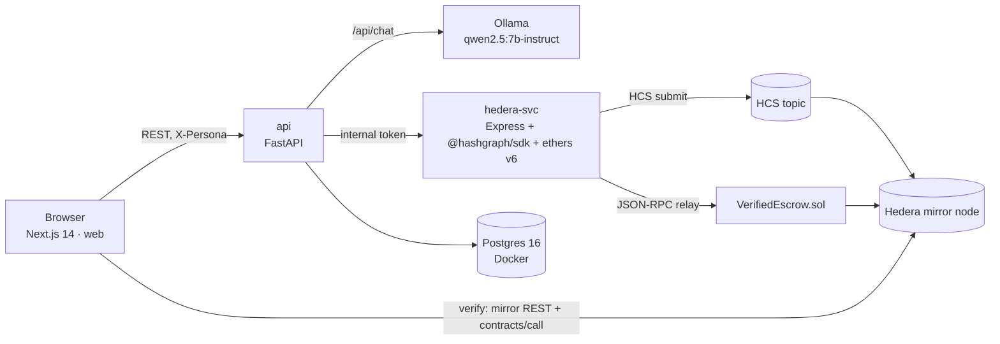

# Verified-Then-Paid Escrow

An AI judges a text deliverable against a statement of work (SOW). The **full evaluation record is anchored on the Hedera Consensus Service before anyone sees the verdict**. An escrow contract then releases or holds the HBAR. Anyone can re-check the record in their browser, straight from the public mirror node.

Built for the Hedera Cross Campus Challenge (demo on 3 Oct 2026). It runs on Hedera **testnet**.

## Why it's trustworthy

- **The record is fixed before the verdict is revealed.** It holds the SOW, the deliverable, the verdict, the reasoning, the model version and a timestamp, as canonical JSON. It's submitted to an HCS topic that only the oracle can write to. The app shows the verdict only after the mirror node has confirmed those exact bytes by hash.
- **The contract commits to the same record.** `submitVerdict` stores the record's SHA-256 (`verdictHash`), the pass/fail, and the SOW hash on-chain, then releases or holds the funds.
- **Verification happens in the browser, not on our server.** `/verify/<escrowId>` checks four things:
  - it fetches the anchored bytes from the mirror node, using the topic ID built into the page;
  - it hashes them, and the app's copy, with `@noble/hashes`;
  - it checks that the escrow contract commits to the same record (the oracle-consistency check);
  - it scans the whole topic, so it still works if the database rows are deleted, and it flags a second, different record for the same escrow.
- **Tampering is caught.** Change the verdict in the database (`demo/tamper.sql`) and the page turns red, with a field diff. The anchored record, still FAIL, is shown from Hedera.

What this does **not** prove: that the model's judgement was right, or that nobody manipulated the evaluation *before* it was anchored. See the limitations in `docs/02-TRD.md` §15.

## Architecture



- **Pipeline:** FUNDED → EVALUATING → ANCHORING → CONFIRMING → SUBMITTING_VERDICT → RELEASED or HELD. ERROR pauses the contract and resumes from where it stopped.
- **Where the specs live:** `docs/01-PRD.md` (scope), `docs/02-TRD.md` (design), `docs/03-APP-FLOW.md` (screens and the demo run sheet), `docs/04-BACKEND-SCHEMA.md` (DDL and API), `docs/05-IMPLEMENTATION-PLAN.md` (plan).

## Live deployment (testnet)

| What | HashScan |
| --- | --- |
| `VerifiedEscrow` contract `0x3dc2bb3a…a4f016` | https://hashscan.io/testnet/contract/0x3dc2bb3a0077426381d0afe837be9c4edba4f016 |
| HCS record topic `0.0.10748103` | https://hashscan.io/testnet/topic/0.0.10748103 |
| Oracle account `0.0.10742743` | https://hashscan.io/testnet/account/0.0.10742743 |
| Client (Amira) `0.0.10746385` | https://hashscan.io/testnet/account/0.0.10746385 |
| Freelancer (Youssef) `0.0.10746386` | https://hashscan.io/testnet/account/0.0.10746386 |
| Arbitrator (Nour) `0.0.10746388` | https://hashscan.io/testnet/account/0.0.10746388 |

**Seeded demo contracts.** Each ran the real pipeline on testnet with 5 ℏ.

| Seed | Escrow | Outcome | Funding | HCS record | Verdict |
| --- | --- | --- | --- | --- | --- |
| S1 "Landing page copy for Nour Studio" | #15 | PASS → Released | [tx](https://hashscan.io/testnet/transaction/1790685115.059461104) | [seq 16–17](https://hashscan.io/testnet/transaction/0.0.10742743-1790685263-600364988) | [tx](https://hashscan.io/testnet/transaction/1790685277.261876013) |
| S2 "Product FAQ for Olive & Co" | #16 | FAIL (no prices) → Held | [tx](https://hashscan.io/testnet/transaction/1790685288.158850104) | [seq 18–19](https://hashscan.io/testnet/transaction/0.0.10742743-1790685422-881420414) | [tx](https://hashscan.io/testnet/transaction/1790685439.089003779) |
| S3 "Event recap for IEEE SMU" | #17 | FAIL, prompt injection flagged → Held | [tx](https://hashscan.io/testnet/transaction/1790685447.398695104) | [seq 20–21](https://hashscan.io/testnet/transaction/0.0.10742743-1790685773-928809245) | [tx](https://hashscan.io/testnet/transaction/1790685786.512337104) |
| Replay fallback test (`DEMO_REPLAY=1`) | #22 | PASS → Released; `model_version = replay/…` | [tx](https://hashscan.io/testnet/transaction/1790710296.080613743) | [seq 30–31](https://hashscan.io/testnet/transaction/0.0.10742743-1790710300-326777533) | [tx](https://hashscan.io/testnet/transaction/1790710312.880653460) |

Once the stack is running, open `http://localhost:3000/verify/16` to check S2 yourself.

## Setup (native Windows)

Everything runs natively on Windows 11; Docker Desktop runs only Postgres.

**Prerequisites:**
- Node 20+ (tested on 22.19) and pnpm 10 (`npm i -g pnpm@10`)
- Python 3.11
- Docker Desktop
- [Ollama](https://ollama.com) running natively

**Steps:**

1. **Pull the model:**
   ```powershell
   ollama pull qwen2.5:7b-instruct
   ```
2. **Install dependencies:**
   ```powershell
   pnpm -r install
   cd api; py -3.11 -m venv .venv; .\.venv\Scripts\pip install -r requirements.txt; cd ..
   ```
3. **Configure.** Copy each `.env.example` to `.env` in `api/`, `hedera-svc/` and `web/`.
   - `hedera-svc/.env` holds the four testnet accounts: account IDs, plus ECDSA keys as raw hex (0x + 64 hex characters, not DER).
   - `INTERNAL_TOKEN` must be the same value in `api/.env` and `hedera-svc/.env`.
   - Keys live **only** in `hedera-svc/.env`, which is git-ignored.
4. **Database:**
   ```powershell
   docker compose up -d db
   cd api; .\.venv\Scripts\alembic upgrade head; cd ..
   ```
5. **Contract and topic** (already deployed; only redo this for a fresh deployment):
   ```powershell
   cd contracts; npx hardhat run scripts/deploy.ts --network hederaTestnet
   ```
   This writes `shared/deployment.json`. Rebuild `web` afterwards. A redeploy means a new topic and new seeds.

## Run

```powershell
scripts\start-all.ps1                  # db + hedera-svc + api + production web build, each in its own window
scripts\start-all.ps1 -Dev             # next dev + uvicorn --reload, no model warm-up (UI work)
scripts\start-all.ps1 -Only web        # (re)start one service: hedera-svc | api | web
scripts\start-all.ps1 -Only api -Replay   # api with DEMO_REPLAY=1: replays S1's recorded verdict, no Ollama
scripts\stop-all.ps1 [-Only <service>]    # stops only the windows start-all opened
```

Then open **http://localhost:3000**. Check `http://localhost:8000/health`: every dependency should be `ok`, and `forced_eval_error` should be `false`.

- **Personas:** switch between Client, Freelancer and Arbitrator in the header. For two roles at once, use two Chrome profiles.
- **Self-test:** `http://localhost:3000/dev/selftest` must say `PASS (6/6)`.

## Demo scripts

| Command | What it does |
| --- | --- |
| `api\.venv\Scripts\python demo\seed.py --fresh` | Seeds S1–S3 through the real pipeline, asserts each end state, and takes a snapshot |
| `demo\reset.ps1` | Restores the seeded DB from `demo/snapshot.dump` in a few seconds. Refresh every browser window afterwards |
| `docker compose exec db psql -U vte -d vte`, then `\i /demo/tamper.sql` | Flips S2 to PASS in the DB (the tamper demo) |
| `pnpm --filter hedera-svc recycle` | Moves the freelancer's balance above 3 ℏ back to the client |
| `api\.venv\Scripts\python demo\record_replay.py 1` | Records S1's real evaluation for the replay fallback (FR-29) |

The click-by-click stage run sheet is in `docs/03-APP-FLOW.md` §9, and the pre-flight checklist in `docs/05-IMPLEMENTATION-PLAN.md` §10.

**Timing.** On the demo laptop (GTX 1650 Ti 4 GB, 15 GB RAM), deliverable → Paid takes 47–53 s, which is within NFR-2's 60 s. In replay mode it takes 11.6 s.

## Tests

```powershell
cd api; .\.venv\Scripts\python -m pytest tests; cd ..   # 44 tests (uses a separate vte_test database)
pnpm --filter canonical test                             # canonical JSON + HCS reassembly, TS side
cd contracts; npx hardhat test; cd ..                    # 8 contract tests
python scripts\ui\run_sheet.py                           # Playwright: the whole demo run sheet (spends testnet HBAR)
```

Browser checks for each feature are in `scripts/ui/`. The build log, with every check's output, is in `docs/progress/day1.md`–`day4.md`.

## Repository layout

```
api/            FastAPI: pipeline, evaluator, canonical record, mirror confirmation
hedera-svc/     Express: HCS submit (executeAll, single-flight), escrow calls via ethers + Hashio relay, recycle
contracts/      Hardhat: VerifiedEscrow.sol (solc 0.8.24) + tests + deploy
web/            Next.js 14: dashboard, contract detail, arbitration, /verify, /dev/selftest
packages/canonical/  shared TS: canonical JSON + SHA-256 (@noble/hashes), HCS reassembly, HashScan links
shared/deployment.json  contract address, ABI, topic ID (bundled into web at build time)
demo/           seed, snapshot, reset, tamper, replay recording
docs/           PRD, TRD, App Flow, Backend Schema, Plan, Demo content, progress reports
```
