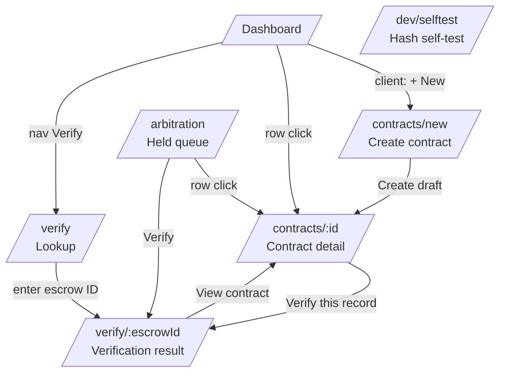
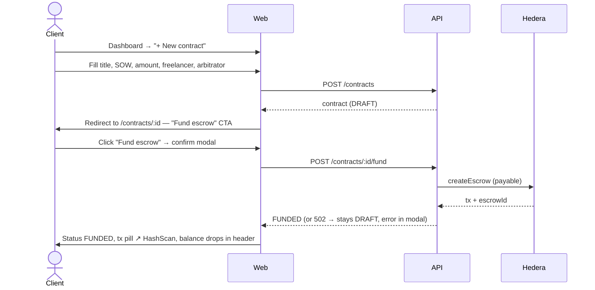
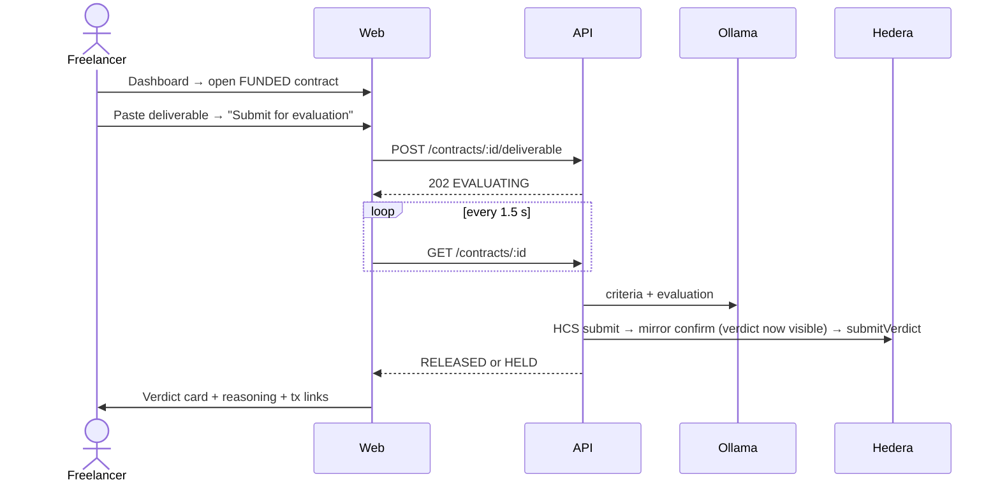
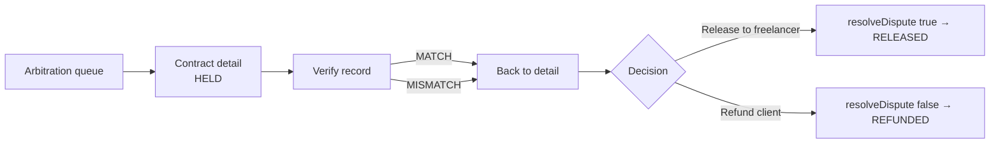

# App Flow — Verified-Then-Paid Escrow

*App Flow Document · v1.1 · 26 Sep 2026 · Owner: Hedi*
*Companion to `01-PRD.md` (FR-x), `02-TRD.md` (routes §11, states §9, API §10) and `06-DEMO-CONTENT.md` (demo texts). v1.1 changes are listed at the end.*

---

## 1. Purpose

This document defines every screen, how users move between them, what each screen shows in every contract state, and the exact click path of the stage demo. It is the build reference for `web/`.

**Two IDs, never mixed up:**

- `/contracts/:id` uses the **DB id** (internal).
- `/verify/:escrowId` uses the **on-chain escrow ID**. That is the ID inside the anchored record and on HashScan, so a stranger can verify without knowing anything about our database.

## 2. Global layout

```
┌──────────────────────────────────────────────────────────────────┐
│ ◆ Verified Escrow   Dashboard  Arbitration  Verify   [Persona ▾] │
│                                          Amira (Client) · 74.1 ℏ │
├──────────────────────────────────────────────────────────────────┤
│                                                                  │
│                         page content                             │
│                                                                  │
├──────────────────────────────────────────────────────────────────┤
│ testnet · topic 0.0.xxxxx · contract 0x…abcd · system ● healthy  │
└──────────────────────────────────────────────────────────────────┘
```

- **Persona switcher** (FR-26): a dropdown with Client / Freelancer / Arbitrator.
  - Each option shows the name, account ID and live HBAR balance from `GET /personas`.
  - Switching sets a cookie and reloads the current page.
  - It is hidden on `/verify/*`, which is public.
- **Nav items by persona:**

  | Persona | Nav items |
  | --- | --- |
  | Client | Dashboard, **+ New contract**, Verify |
  | Freelancer | Dashboard, Verify |
  | Arbitrator | Dashboard, **Arbitration** (with held-count badge), Verify |

- **Footer health bar:** calls `GET /health` every 10 s. It shows a dot per dependency (db, ollama, hedera-svc, mirror) and turns amber or red if any dependency is down. Topic and contract come from `/health`, which reads `deployment.json`.
- **Link convention:** every Hedera artefact (transaction, topic message, contract, account) renders as a monospace pill with a ↗ HashScan link, built by one helper (TRD §11).
- **Header balances** re-fetch whenever a contract reaches a terminal status, so "balance drops / +5 ℏ" is visible without a page reload.

## 3. Screen map



`/dev/selftest` is not linked in the nav. It is used on Day 1 and before every rehearsal.

## 4. Persona flows

### 4.1 Client — create and fund (US-1, US-2)



### 4.2 Freelancer — submit and get paid (US-4, US-5, US-6)



### 4.3 Arbitrator — resolve a held contract (US-7, US-8, US-9)



- The arbitrator decides on the merits after verification. On a MISMATCH, they judge the **anchored** record shown on the verification page, not the app's copy.
- A MISMATCH banner is evidence of operator tampering. It does not decide the outcome automatically.
- `EVALUATION_ERROR` holds show "The evaluator couldn't produce a verdict", and the arbitrator judges the deliverable directly.

### 4.4 Anyone — verify (US-10, US-11)

`/verify` → enter escrow ID → `/verify/:escrowId` → MATCH or MISMATCH, with a diff on mismatch and the anchored record shown from Hedera. No persona is needed.

## 5. Screen specifications

### 5.1 Dashboard `/`

**Purpose:** a list of the current persona's contracts.

| Element | Detail |
| --- | --- |
| Header | "Your contracts" + persona role chip |
| Primary CTA | Client only: **+ New contract** |
| Table columns | ID · Escrow # · Title · Counterparty (arbitrator sees "Client → Freelancer") · Amount (ℏ) · Status badge · Updated |
| Filter chips | All · Active (FUNDED/EVALUATING…) · Held · Closed (RELEASED/REFUNDED) |
| Row click | → `/contracts/:id` |
| Empty state (client) | "No contracts yet. Create one to lock funds in escrow." + CTA |
| Empty state (freelancer) | "No contracts assigned to you yet." |
| Empty state (arbitrator) | "Nothing to review." + link to Arbitration |

**Status badge colours** (used everywhere):

| Status | Label | Colour |
| --- | --- | --- |
| DRAFT | Draft | grey |
| FUNDED | Funded · awaiting work | blue |
| EVALUATING / ANCHORING / CONFIRMING / SUBMITTING_VERDICT | In progress | violet, animated |
| RELEASED | Paid | green |
| HELD | Held for review | amber |
| REFUNDED | Refunded | slate |
| ERROR | Paused · error | red |

### 5.2 Create contract `/contracts/new` (client only)

| Field | Control | Validation (mirrors API; API is authoritative) |
| --- | --- | --- |
| Title | text | required, ≤ 120 chars |
| Statement of Work | textarea (markdown), live char counter | required, 50–4,000 chars |
| Amount | number + "ℏ" suffix | > 0, ≤ 100, ≤ client balance − 2 ℏ fee margin, ≤ 8 decimals |
| Freelancer | select (persona list, freelancer preselected) | required |
| Arbitrator | select (arbitrator preselected) | required, ≠ client, ≠ freelancer |

- A helper panel on the right: "Write requirements the AI can check by reading the text, e.g. 'includes a pricing section', 'mentions the delivery date'. Avoid word counts: the local model can't count reliably."
- The **"Use example SOW"** button fills the **title, SOW and amount (5 ℏ)** from S1 in `06-DEMO-CONTENT.md`, so there is nothing to type on stage.
- Counters count code points (`[...text].length`), matching Postgres `char_length`, not JS `.length`.
- Submit button: **Create draft** → `POST /contracts` → redirect to detail.
- Leaving with unsaved input shows a browser confirm.

### 5.3 Contract detail `/contracts/:id` — the main screen

Layout: a left column holds the content; a right column holds the on-chain panel.

```
┌───────────────────────────────────────────────┬───────────────────────────┐
│ Landing page copy for Nour Studio   [Funded]  │ ON-CHAIN                  │
│ Client Amira → Freelancer Youssef · 5 ℏ       │ Escrow #7  ↗              │
│                                               │ Funding tx 0x9f2c… ↗      │
│ ┌ Status stepper ───────────────────────────┐ │ sowHash 0x3fa1…  ⧉        │
│ │ ● Funded ─ ○ Evaluating ─ ○ Anchoring ─   │ │ HCS msgs #— (pending)     │
│ │ ○ Confirming ─ ○ Verdict ─ ○ Paid/Held    │ │ verdictHash —             │
│ └───────────────────────────────────────────┘ │ Verdict tx —              │
│                                               │                           │
│ ▸ Statement of Work (collapsible)             │ [ Verify this record ]    │
│ ▸ Deliverable / submission area               │                           │
│ ▸ Evaluation (criteria · verdict · reasoning) │                           │
│ ▸ Timeline                                    │                           │
└───────────────────────────────────────────────┴───────────────────────────┘
```

Contract calls go through the JSON-RPC relay, so the funding and verdict transactions are **EVM hashes** (`0x…`), not SDK-style `0.0.x@…` IDs. **Verify this record** stays disabled until the record is confirmed on the mirror node, and links to `/verify/{escrowId}`.

#### What each persona sees, by state

| State | Client | Freelancer | Arbitrator |
| --- | --- | --- | --- |
| **DRAFT** | **Fund escrow** button → confirm modal ("Lock 5 ℏ in a new escrow — this sends a testnet transaction") | "Waiting for the client to fund" | read-only |
| **FUNDED** | "Waiting for the deliverable" | **Deliverable editor**: markdown textarea, counter ≤ 8,000, preview tab. Under `DEMO_MODE=1`, P1 **Insert sample** menu (good / weak) from `06-DEMO-CONTENT.md`. **Submit for evaluation** + confirm modal ("One submission only. The AI verdict will be anchored on Hedera before anyone sees it.") | read-only |
| **EVALUATING / ANCHORING / CONFIRMING** | Live stepper; the verdict is **not shown** (FR-11) | same | same |
| **SUBMITTING_VERDICT** | Stepper on "Verdict"; the evaluation section appears (it is now anchored and confirmed) with a "Submitting to escrow…" tag | same | same |
| **RELEASED** | Green verdict card "PASS — 5 ℏ released", evaluation section, release tx | same + "Payment received" | read-only |
| **HELD** | Amber card "FAIL — held for arbitrator review" (or "Evaluator couldn't produce a verdict — held for review" for `EVALUATION_ERROR`), evaluation section | same + "An arbitrator will review this" | **Release to freelancer** / **Refund client** buttons + confirm modal |
| **REFUNDED** | Slate card "Refunded to client" + refund tx | same | read-only |
| **ERROR** | Red card: "Paused at <step>", error message, **Retry** button. The verdict is shown only if the record was already confirmed | same | same |

#### Status stepper copy (FR-16)

| Step | In progress label | Done label | Typical time |
| --- | --- | --- | --- |
| Evaluating | "AI is reading the SOW and deliverable…" | "Evaluated" | 10–30 s |
| Anchoring | "Writing the record to Hedera Consensus Service…" | "Anchored · msgs #41–43" | 3–8 s |
| Confirming | "Waiting for consensus via the public mirror node…" (after 30 s: "…taking longer than usual") | "Confirmed at 14:22:09.481 UTC" | 3–8 s |
| Verdict | "Submitting verdict to the escrow contract…" | "Verdict on-chain" | 3–6 s |
| Paid / Held | — | "Released" / "Held for review" | — |

The active step shows a spinner plus an elapsed-time counter. This makes the demo read as live work, not a hang (spec §14).

**Criteria sub-step.** From funding until the criteria are cached, the Funded step (and then Evaluating) shows "Reading the SOW…" with a spinner. Once `criteria_ready` is true, it shows "✓ Criteria ready", with "(reused from an identical SOW)" when they were copied from a contract with the same `sow_hash` (TRD §8.2). The timeline then has a "Criteria reused" entry naming the source escrow.

#### Evaluation section (once `/evaluation` returns `available: true`)

- The **verdict** with its confidence bar.
- The **reasoning** text.
- A `model_version` pill. If it starts with `replay/`, a grey chip reads "Replayed verdict (demo fallback)" (FR-29).
- If `injection_suspected` is true, an amber chip: "Deliverable contained instructions aimed at the evaluator."
- A **criteria table**: ID · Criterion · Required · Met ✓/✗ · Evidence (expandable). It carries a small label: "**Not anchored in v1** — display only." The verdict, reasoning, SOW and deliverable are anchored; this table is not (Schema §4.1).

#### Timeline section

A chronological list from `timeline[]`: created, funded (tx), deliverable submitted, evaluated ("Evaluation complete", with no verdict), anchored (HCS seq), confirmed, verdict (tx), resolved (tx), plus error / retried / reconciled when they happen. Each entry has a timestamp and a link.

#### Dispute (FR-19, P1)

On a RELEASED contract, the client and freelancer see a **Flag as disputed** link.

1. It opens a modal with a reason text field and calls `POST /contracts/:id/dispute`.
2. This adds a "Disputed" chip and a timeline entry, and shows a banner pointing to **Verify this record**.

### 5.4 Arbitration `/arbitration` (arbitrator only)

| Element | Detail |
| --- | --- |
| Table | ID · Escrow # · Title · Client · Freelancer · Amount · Held since · Hold reason (`FAILED_VERDICT` / `EVALUATION_ERROR`) |
| Row actions | **Review** → detail · **Verify** → `/verify/{escrowId}` in a new tab |
| Empty state | "No contracts held for review." |

### 5.5 Verification lookup `/verify`

A single input, "Escrow ID", with a **Verify** button. Below it, a short explainer (three lines):

1. "We fetch the record this app shows from its database."
2. "We fetch the original record straight from Hedera's public mirror node. The topic and contract addresses are built into this page, so the server can't redirect the check."
3. "Your browser hashes both and compares."

### 5.6 Verification result `/verify/:escrowId` — the demo-critical screen

**Loading sequence:** the steps render as a checklist so the audience sees the independence of each check.

```
☑ Loaded displayed record from app database
☑ Fetched HCS messages #41–43 (3 chunks) from testnet mirror node ↗
☑ Anchored record belongs to escrow #7
☑ Hashed displayed record in your browser   → 9b1c…e04a
☑ Hashed HCS record in your browser         → 9b1c…e04a
☑ Escrow contract commits to the same record (P1)
```

**MATCH state (green):**

```
┌──────────────────────────────────────────────────────────────┐
│ ✅  VERIFIED — the record shown matches the record anchored on │
│     Hedera at 14:22:09.481 UTC, before the verdict was         │
│     revealed to anyone.                                        │
└──────────────────────────────────────────────────────────────┘
Anchored record (from Hedera): Verdict FAIL · Model ollama/qwen2.5:7b-instruct@845dbda0ea48
Reasoning: …                                          [View contract]
```

v1.0's banner said "the verdict shown is the verdict the AI produced". MATCH doesn't prove that. It proves the record wasn't changed after it was anchored; manipulation before anchoring is a stated limitation. The new wording claims only what is checked (NFR-8).

**MISMATCH state (red):**

```
┌──────────────────────────────────────────────────────────────┐
│ ⛔  TAMPERING DETECTED — the record shown by this app does     │
│     not match the record anchored on Hedera.                  │
└──────────────────────────────────────────────────────────────┘
Displayed hash  7c02…91aa     Anchored hash  9b1c…e04a

Field-by-field comparison
┌────────────┬──────────────────────┬──────────────────────┐
│ Field      │ Shown by app (DB)    │ Anchored on Hedera   │
├────────────┼──────────────────────┼──────────────────────┤
│ verdict    │ pass                 │ fail                 │  ← highlighted
│ reasoning  │ All criteria met…    │ C2 (pricing) is mis… │  ← highlighted
│ sow        │ (identical)          │                      │
│ …          │                      │                      │
└────────────┴──────────────────────┴──────────────────────┘
The anchored version is the one produced at evaluation time. Judge that one.
```

**Evidence panel** (both states):

- topic ID (from the bundled `deployment.json`)
- sequence numbers and consensus timestamp
- escrow ID and on-chain status
- on-chain `verdictHash`

Every item links to HashScan. With the **P1 oracle-consistency check** (FR-25), the panel adds one row: "Escrow contract ✓ / HCS ✓ / App ✗". Contract ✓ means all of these hold:

- on-chain `verdictHash` = anchored hash
- `verdictPassed` agrees with the anchored verdict
- `sowHash` = hash of the anchored SOW

**Other states:**

| Condition | UI |
| --- | --- |
| Contract not yet confirmed | Neutral grey: "No anchored record yet — status: ANCHORING." |
| Escrow ID unknown to the app | "No contract found in this app." With the P1 topic scan: "…but Hedera holds an anchored record for escrow #7", then show that record (the deletion case) |
| Anchored record's `contract_id` ≠ requested escrow ID | Red: "The backend pointed to a record for a different escrow." |
| `api` reports a topic other than the bundled one | Red: "The backend points to an unexpected topic." |
| Topic scan finds 2+ records for this escrow with different hashes | Red: "Multiple different records anchored for this escrow." The one matching the on-chain `verdictHash` is marked authoritative |
| Mirror node unreachable | Red-grey: "Couldn't reach Hedera mirror node — verification not possible. Retry." (never shows MATCH by default) |
| HCS chunk missing | "Anchored record incomplete (2 of 3 chunks) — retry in a few seconds." |

**Rule:** the page never shows green unless both hashes were computed in the browser in this session. It never shows green if any red condition above is true.

### 5.7 Self-test `/dev/selftest`

A table of the fixture records (`packages/canonical/fixtures/`) with four columns (expected hash, browser-computed hash, bytes-identical ✓/✗, PASS/FAIL), plus a large overall PASS/FAIL banner. Run it before every rehearsal.

## 6. Modals and confirmations

| Modal | Trigger | Content | Primary action |
| --- | --- | --- | --- |
| Fund escrow | Client, DRAFT | Amount, freelancer, arbitrator, "sends a testnet transaction". On a timeout: "Check HashScan before retrying so you don't create two escrows" | Lock funds |
| Submit deliverable | Freelancer, FUNDED | One-submission warning, anchoring note, char count | Submit |
| Resolve | Arbitrator, HELD | "Release 5 ℏ to Youssef" or "Refund 5 ℏ to Amira"; reminder to verify first | Confirm |
| Flag dispute | Client/Freelancer, RELEASED | Reason textarea | Flag |

Every modal disables its button and shows a spinner while waiting. Errors show inline and keep the modal open.

## 7. Notifications

Toasts appear at the bottom-right and last 5 s.

| Event | Toast |
| --- | --- |
| Draft created | "Draft saved" |
| Funded | "5 ℏ locked in escrow #7 ↗" |
| Deliverable submitted | "Submitted — evaluation started" |
| Anchored | "Record anchored on Hedera · msgs #41–43 ↗" |
| Released | "5 ℏ released to Youssef ↗" |
| Held | "Verdict: fail — held for review" |
| Resolved | "Dispute resolved: released / refunded ↗" |
| Error | Red, sticky until dismissed, with the step name |

## 8. Global error and edge states

| Situation | Behaviour |
| --- | --- |
| API unreachable | Full-width red bar: "Backend offline" and polling pauses |
| Ollama down when the freelancer submits | The submit button is disabled with tooltip "Evaluator offline" (from health) |
| Wrong persona opens an action URL | Actions are hidden; the page is read-only; the API returns 403 if called |
| Page refresh mid-pipeline | Resumes the stepper from the server state (the pipeline is server-side) |
| Two personas at once | The persona is a cookie, so every tab in one browser profile shares it. Use **separate Chrome profiles** (W1 Client, W2 Freelancer) |
| After `demo/reset` | Refresh every window; SWR caches still hold the pre-reset data |
| App opened via a LAN IP instead of `localhost` | Works, because hashing uses `@noble/hashes`, not `crypto.subtle`. Still use `localhost` on stage |

## 9. Demo run sheet (spec §14, click-by-click)

**Setup before going on stage:**

- seed data loaded (`demo/reset`) and every window refreshed
- Ollama warmed, with `keep_alive` set
- `/dev/selftest` green
- balances checked (`demo/recycle` run after the last rehearsal)

Three windows open:

- **W1** — Chrome profile "Client"
- **W2** — Chrome profile "Freelancer"
- **W3** — terminal already inside `docker compose exec db psql -U vte -d vte`

Also open one HashScan tab on the topic.

**Confirm the presentation slot length first** (PRD §13). This sheet takes 4:15 on its own.

| # | Window | Action | Audience sees | Time |
| --- | --- | --- | --- | --- |
| 1 | W1 | Dashboard → **+ New contract** → "Use example SOW" (fills title, SOW, 5 ℏ) → Create draft | Contract in DRAFT | 0:30 |
| 2 | W1 | **Fund escrow** → confirm, then click the funding tx pill ↗ and show the `createEscrow` call on HashScan. This is a natural ~30 s beat: the criteria are being extracted from the SOW meanwhile (TRD §8.1 fallback 1), so step 3's wait is the evaluation only | Balance drops; tx pill; HashScan shows the contract call | 0:30 |
| 3 | W2 | Open contract → **Insert sample → good** (or paste) → Submit | Stepper starts | 0:15 |
| 4 | W2 | Narrate while the stepper runs; click the "Anchored · msgs #N–M" link | HCS messages live on HashScan | 0:45 |
| 5 | W2 | Stepper reaches **Paid** | Green PASS card; freelancer balance +5 ℏ | 0:15 |
| 6 | W1 | Open seeded **S2** ("Product FAQ for Olive & Co", HELD, FAIL) → **Verify this record** | Green MATCH banner (control case) | 0:30 |
| 7 | W3 | `\i /demo/tamper.sql`, flipping `verdict` to `pass` and rewriting `reasoning`. Narrate: "same access a malicious operator has" | `UPDATE 1`, `UPDATE 1`, then the lied-about row | 0:20 |
| 8 | W1 | Refresh the contract detail | It now claims PASS (the lie) | 0:10 |
| 9 | W1 | Refresh `/verify/:escrowId` | **Red TAMPERING DETECTED**; diff shows verdict pass ≠ fail; anchored panel still says FAIL; (P1) "Escrow contract ✓ / HCS ✓ / App ✗" | 0:30 |
| 10 | — | Close (see below) | — | 0:30 |

**Step 10 closing line:** "Hedera contracts can't read HCS on their own. Hedera's own proposal on this, HIP-478, says to route it through an oracle. That's what we built, except our oracle can't lie quietly: every claim it makes is checkable by anyone, right in the browser."

v1.0's line ("contracts can't read HCS by design") overstated HIP-478, which calls direct reads possible but rejected in favour of an oracle (TRD §15).

The total is **4:15** (v1.0 said "about 4.5 minutes"; the rows add up to 4:15).

**Fallbacks:**

- If steps 3–5 stall for more than **90 s**, switch to seeded **S1** (already RELEASED) and continue from step 6. The pipeline keeps running in the background. (v1.1 said 60 s. On the demo laptop, deliverable → Paid measured 70–85 s on Day 2, so 60 s would trigger on a healthy run.)
- If Ollama fails, use the FR-29 replay (P1). Its record says `replay/…` in `model_version`, and the UI shows the chip.
- If testnet is down, play the backup screen recording.

After the demo, run `demo/reset` (a few seconds, FR-28) and `demo/recycle`, then refresh every window.

## 10. Responsive and accessibility notes

- Target is desktop 1280–1920 px (projector). The layout collapses to a single column below 900 px.
- Projector legibility: base font 16 px, verdict banners 24 px, hashes in 14 px monospace with truncation and a copy button.
- MATCH/MISMATCH is never conveyed by colour alone. It always includes an icon and text.
- All modals are keyboard-reachable; focus returns to the trigger on close.

## Change log

| Version | Change |
| --- | --- |
| v1.1 (26 Sep) | Verification routes use the escrow ID. The verdict becomes visible at mirror confirmation (SUBMITTING_VERDICT row added); ERROR is shown as paused with Retry; EVALUATION_ERROR hold copy. MATCH banner reworded to claim only what is proven; anchored record shown from Hedera; new red states (wrong escrow, unexpected topic, multiple records); P1 oracle-consistency row. Criteria table labelled "not anchored in v1". Funding tx shown as EVM hash. Amounts 5 ℏ. "Use example SOW" fills title too; DEMO_MODE Insert-sample menu (P1); presence-based SOW helper text. Run sheet: total corrected to 4:15, tamper via `\i /demo/tamper.sql` inside the container, closing line corrected per HIP-478, reset + recycle + refresh after the demo. Two-profile wording fixed. |
| 27 Sep (build) | §9: after funding, click the funding tx on HashScan (a natural ~30 s beat while criteria are extracted); stall fallback moved from 60 s to 90 s. |
