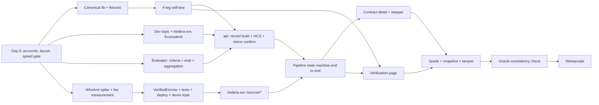

# Implementation Plan — Verified-Then-Paid Escrow

*Implementation Plan · v1.1 · 26 Sep 2026 · Owner: Hedi (solo)*
*Builds against `01-PRD.md`, `02-TRD.md`, `03-APP-FLOW.md`, `04-BACKEND-SCHEMA.md` and `06-DEMO-CONTENT.md` (all v1.1). What changed and why: `00-REVIEW-REPORT.md`.*

---

## 1. Timeline at a glance

| Date | Day | Theme | End-of-day gate (must be true before sleeping) |
| --- | --- | --- | --- |
| Sat 26 Sep | Day 0 (evening) | Accounts, tooling, reality checks | 4 funded ECDSA testnet accounts; faucet reality known; testnet status checked; Ollama speed gate passed (or fallback chosen) |
| Sun 27 Sep | **Day 1** | Trust core: hashing + HCS + evaluator | Four-leg hash self-test passes; one real record on the dev topic, confirmed via mirror node, from a real Ollama verdict |
| Mon 28 Sep | **Day 2** | Contract + full pipeline | Deliverable → verdict → HCS → `submitVerdict` → HBAR released on testnet, driven by `api`; evaluation-error path ends `Held` on-chain |
| Tue 29 Sep | **Day 3** | Frontend + verification page | Full demo click path works in the browser, including tamper → red MISMATCH |
| Wed 30 Sep | Prep session | Validate with organisers; P1 items | Open questions answered; seeds + snapshot created |
| Thu 1 Oct | Polish | Oracle check, hardening, pitch deck | 3 clean rehearsals |
| Fri 2 Oct | Rehearse | Freeze code, backup recording | 5 clean rehearsals; code frozen at 18:00 |
| Sat 3 Oct | Hackathon | Present | — |

Assumed capacity: about 10 focused hours on each of Days 1–3, and about 6 hours on each of 30 Sep–2 Oct. Estimates below include debugging slack. v1.1 adds about 1h15 of work in total. It saves about 1h back, because the contract tests (T2.2) and all demo texts (T1.8, T1.9, T4.2) are now written for you.

## 2. Critical path

**The four things that can sink the project, all de-risked by Day 1 noon:**

1. hash drift between languages (T1.3)
2. `msg.sender`, value units and fees on Hedera EVM (T1.6)
3. local model output quality (T1.8, T1.9)
4. **local model speed and testnet HBAR supply** (T0.1, T0.2): new in v1.1, and cheapest to discover tonight

## 3. Day 0 — Sat 26 Sep evening (≈ 2 h 30)

| ID | Task | Est | Done when |
| --- | --- | --- | --- |
| T0.0 | Skim `00-REVIEW-REPORT.md` (top section) so v1.1 decisions are fresh before you type code | 15m | Done |
| T0.1 | Create 4 **ECDSA** testnet accounts in the Hedera Portal (oracle, client, freelancer, arbitrator). Copy each **raw HEX private key** (`0x`+64 hex), not the DER one. Fund them, and **note what the faucet/Portal actually gives per day**. Check `status.hedera.com` for a scheduled testnet reset and subscribe | 45m | All visible on HashScan with EVM aliases; balances at the TRD §4 minimums (oracle ≥ 40, client ≥ 40, arbitrator ≥ 5, freelancer ≥ 2 ℏ); no reset announced before 4 Oct |
| T0.2 | `ollama pull qwen2.5:7b-instruct`; set `OLLAMA_KEEP_ALIVE=-1`; **speed gate**: run both prompts (criteria, then evaluation) on the S1 SOW and deliverable from `06-DEMO-CONTENT.md` with `format` = JSON schema, `num_ctx` 8192 and `num_predict` 512 (criteria) / 1200 (evaluation) per TRD §8.1 (`scripts/speed-gate.ps1`). **Result 27 Sep (GTX 1650 Ti 4 GB, 2.2 of 5.4 GB on GPU): both steps 65–84 s warm at `num_ctx` 8192, 85 s at 4096 → fail. Fallback 1 (criteria at funding, `-CriteriaAtFunding`): evaluation step 29.3 s and 29.1 s warm → PASS. 7B kept; `num_ctx` stays 8192** | 30m | Valid JSON from both, total ≤ 40 s. If not, pull `qwen2.5:3b-instruct` and re-run, and note that criteria extraction moves to funding time (TRD §8.1) |
| T0.3 | Repo skeleton per TRD §13: `npx create-next-app@14`, pnpm workspace (`web`, `hedera-svc`, `packages/canonical`, `contracts`), `docker-compose.yml` from Schema §8.3 (with the `./demo` mount), `.gitattributes` (`packages/canonical/fixtures/** -text`, `*.sh text eol=lf`). Everything runs **natively on Windows**, with Docker Desktop for Postgres only; no WSL (TRD §18) | 45m | `docker compose up db` works; `pnpm -r install` clean; `curl localhost:11434/api/tags` works |
| T0.4 | Write `.env` files from TRD §12, one variable per line; add them to `.gitignore` | 10m | `git status` shows no `.env` |

If the faucet can't reach the minimums tonight, ask in the bootcamp channel now. Don't discover this on Day 2.

## 4. Day 1 — Sun 27 Sep: the trust core (≈ 10 h)

**Morning — de-risk (must finish by ~13:00)**

| ID | Task | Est | Done when |
| --- | --- | --- | --- |
| T1.1 | `packages/canonical`: `canonicalString`, `canonicalBytes`, `recordHash`, `bytesHash` with **`@noble/hashes` v2 (`sha2.js`)**, and `normalize` with the explicit ASCII strip set (tests only), per TRD §5.3 + vitest | 45m | Unit tests pass |
| T1.2 | `api/app/services/canonical.py` (normalize with NUL/surrogate rejection, `record_timestamp()`, canonical bytes, hash) + pytest. Write the 6 fixtures in `packages/canonical/fixtures/` as `.json` + `.canonical` + `.sha256`: ASCII, French, Arabic, emoji incl. ZWJ, quotes/backslash/tab/newline, every control char + DEL + U+2028/2029. Open every file with `encoding="utf-8"` | 50m | pytest passes on bytes and hashes; normalization tests reject `\x00` and a lone surrogate |
| T1.3 | **Four-leg self-test:** vitest reads the same fixtures; minimal `web/app/dev/selftest` page hashes them in the browser; `sha256sum packages/canonical/fixtures/*.canonical` matches every `.sha256` | 45m | **All four agree on all 6 fixtures — hard gate** |
| T1.4 | `contracts/scripts/create-dev-topic.ts`: a **dev** topic (submit key = oracle key via `PrivateKey.fromStringECDSA`) for Day 1–2 experiments. The demo topic is created later by `deploy.ts` (T2.3) | 20m | Dev topic on HashScan with submit key shown |
| T1.5 | `hedera-svc`: Express skeleton, token middleware, `POST /hcs/submit` (`setMessage(bytes)`, `executeAll`, first/last receipts, `expectedHash` check, single-flight queue), `GET /accounts`. Check HashScan link formats for account/topic/transaction (TRD §11) | 1h10 | Posting a 3 KB fixture record returns `sequenceFirst` < `sequenceLast`; visible on HashScan; link helper works |
| T1.6 | **WhoAmI spike** (TRD §7.4): Hardhat `hederaTestnet` config, deploy, call `whoami()` and `echoValue{value: parseEther("1")}` from `ethers` with `gasLimit` 400,000 | 40m | `msg.sender` == oracle EVM alias; value reads `100000000`; **fee per call written down**. If > 0.5 ℏ, recompute TRD §4 budget |

**Afternoon — evaluator and anchoring**

| ID | Task | Est | Done when |
| --- | --- | --- | --- |
| T1.7 | `api` skeleton: FastAPI app, config (reads `deployment.json` path), SQLAlchemy models + Alembic `0001_initial` = Schema v1.1 §4 DDL verbatim (it ran clean on Postgres 16 in the review) | 1h | `alembic upgrade head` creates all tables + view |
| T1.8 | `services/evaluator.py`: prompts in `app/prompts/` (TRD §8.2), JSON schemas, Pydantic validation, 3 attempts, **deterministic aggregation with threshold + model flag + regex backstop + 3,000-char reasoning cap** (TRD §8.3), `model_version` from `/api/tags` (12-hex format), `keep_alive: -1`, **`num_predict` 512 (criteria) / 1200 (evaluation); a reply with `done_reason == "length"` is a failed attempt** (TRD §8.1, §8.4), semaphore, warm-up | 2h | Correct verdicts on S1 (pass) and S2 (fail) from `06-DEMO-CONTENT.md`; S3 flagged |
| T1.9 | Evaluator suite `tests/eval_suite.py` on the 6 pairs in `06-DEMO-CONTENT.md`, **run 3 times** | 45m | ≥ 5/6 correct on every run; S3 always flagged; no case flips between runs. If not, simplify that SOW's wording now, not on Day 3 |
| T1.10 | `services/mirror.py`: bounded query (`gte` + `lte`), reassembly rules (initial tx match, null `chunk_info` = 1/1, contiguous numbers), hash check (TRD §6.1) | 45m | Confirms the T1.5 message by hash; unit test with a foreign chunk mixed in still passes |
| T1.11 | Script `scripts/day1_e2e.py`: S1 SOW + deliverable → evaluator → canonical record (`contract_id` = `"dev-1"` on the **dev** topic) → `/hcs/submit` → mirror confirm → print HashScan link | 45m | **Day 1 gate:** a real AI verdict record on the dev topic, hash-confirmed |

**Day 1 slip rule:** if T1.8 runs long, cut T1.9 to S1/S2/S3 × 3 runs. Never skip T1.3 or T1.11.

## 5. Day 2 — Mon 28 Sep: contract + full pipeline (≈ 10 h)

| ID | Task | Est | Done when |
| --- | --- | --- | --- |
| T2.1 | `VerifiedEscrow.sol` exactly as in TRD §7.1 (solc 0.8.24 pinned, `evmVersion` shanghai) | 20m | Compiles |
| T2.2 | Copy the 8 Hardhat tests from TRD §7.2 (they passed against this contract in the review) | 20m | `npx hardhat test` green, 8 passing |
| T2.3 | `scripts/deploy.ts`: deploy to testnet **and create the demo topic**, write `{contractAddress, abi, topicId, deployedAt}` to `shared/deployment.json` | 40m | Contract and topic visible on HashScan; memo names the contract |
| T2.4 | `hedera-svc` `/escrow/create`, `/escrow/verdict`, `/escrow/resolve`, `GET /escrow/:id` (incl. `verdictPassed`). Per-persona `ethers.Wallet`s with **one mutex per signer**, explicit `gasLimit`, `formatUnits(x, 8)` for amounts, `events[]` parsing, 60 s receipt timeout | 1h30 | Manual curl: create → verdict(pass) releases; create → verdict(fail) → resolve(refund) refunds |
| T2.5 | `api/services/hedera_client.py`: typed httpx client for `hedera-svc` | 30m | Used by the routers |
| T2.6 | Routers `personas`, `contracts` (create with validation, fund — failure stays DRAFT, list, get), `verify` (by escrow ID, `confirmed_at` gate) per Schema §5 | 1h30 | Contract can be created and funded via HTTP |
| T2.7 | `services/pipeline.py`: state machine (TRD §9). Atomic claim (no row lock across calls), one-transaction hashing from `v_canonical_record`, **EVALUATION_ERROR record anchored + submitted as fail**, Ollama-unreachable → `ERROR`, resume on startup incl. `EVALUATING`, `CONFIRMING` never resubmits, `SUBMITTING_VERDICT` reads chain first, `ERROR` + retry | 2h15 | `POST /deliverable` on a funded contract ends in `RELEASED` or `HELD` with all rows populated; killing `api` mid-pipeline and restarting finishes the job; a forced evaluation error ends `HELD` on-chain |
| T2.8 | `resolve`, `retry`, `evaluation` endpoints + the single visibility gate (FR-11); `evaluated` timeline text has no verdict | 45m | Arbitrator resolves a HELD contract via HTTP; `/evaluation` returns `available:false` until confirmation |
| T2.9 | `GET /health` covering all 4 dependencies + topic/contract from `deployment.json` | 15m | Returns ok/down per dependency |
| T2.10 | `hedera-svc/scripts/recycle.ts` (freelancer → client, keep 3 ℏ) | 20m | Balance moves back on HashScan |

**Day 2 gate:** the whole business flow runs from HTTP calls alone (curl or a `.http` file), with HashScan links for funding, HCS and the verdict.

**Day 2 slip rule (spec §15 fallback):** if the contract isn't releasing on testnet by 17:00, switch to the no-contract path:

- Funding becomes an SDK `TransferTransaction` from the client to an oracle-held escrow account.
- `SUBMITTING_VERDICT` becomes a `TransferTransaction` from that account, with **memo `vte:<recordHash>`** (64 hex + 4 chars fits the 100-byte memo). The payment then still commits publicly to the anchored record.
- The P1 oracle check reads that memo from the mirror node instead of the contract.

Keep the contract code in the repo and move on to Day 3 on time. Frontend time is not negotiable, because the verification page is the demo.

## 6. Day 3 — Tue 29 Sep: frontend + verification (≈ 10 h)

Build in this order. The verification page comes **second**, not last (spec §10 build priority).

| ID | Task | Est | Done when |
| --- | --- | --- | --- |
| T3.1 | Next.js layout: nav, persona switcher (cookie + `X-Persona`), health footer, HashScan pill + `hashscanUrl` helper, status badge (App Flow §2, §5.1); `transpilePackages`, `deployment.json` import | 1h15 | Switching persona changes nav + balances |
| T3.2 | **`/verify` + `/verify/[escrowId]`**: bundled topic ID, browser mirror fetch + reassembly (`packages/canonical/hcs.ts`), `contract_id` check, browser hashing, loading checklist, MATCH/MISMATCH banners (v1.1 wording), anchored-record panel from HCS, field diff, evidence panel, all red/grey states (App Flow §5.6). Check mirror-node CORS first | 2h15 | On a pipeline-created contract: green. After a manual `UPDATE`: red with the correct fields highlighted, anchored panel unchanged |
| T3.3 | Dashboard with filters and empty states (App Flow §5.1) | 45m | Lists by persona |
| T3.4 | `/contracts/new` with validation + "Use example SOW" (title, SOW, 5 ℏ from `06-DEMO-CONTENT.md`) | 45m | Creates a draft |
| T3.5 | `/contracts/[id]`: persona × state matrix incl. SUBMITTING_VERDICT and ERROR rows, fund / submit / resolve modals, status stepper with elapsed timers + 30 s "taking longer" hint, evaluation card with "not anchored in v1" label, timeline, on-chain panel (App Flow §5.3) | 2h30 | Full flow clickable end to end |
| T3.6 | `/arbitration` queue | 30m | Shows HELD contracts with hold reason |
| T3.7 | Toasts + global error bar | 30m | Events from App Flow §7 fire |
| T3.8 | First full run of the demo run sheet (App Flow §9), including `\i /demo/tamper.sql` in the container | 45m | **Day 3 gate:** entire run sheet works once in the browser |

**Day 3 slip rule — cut these, in this order:** toasts → dashboard filters → timeline section → arbitration page (the arbitrator can act from contract detail) → elapsed timers. Never cut: the stepper, the verification page, and the fund/submit modals.

## 7. Wed 30 Sep — prep session + P1 (≈ 6 h)

| ID | Task | Est | Done when |
| --- | --- | --- | --- |
| T4.1 | **At the prep session**, ask (PRD §13): (1) Is HTS expected specifically? (2) Is 3 Oct or 10 Oct the real deadline? (3) Is judge expectation on contract depth met by the oracle + arbitrator design? (4) Any Agent Kit examples? (5) **How long is the slot and what's in it?** (6) **Venue internet and projector connection?** | — | Answers written into PRD §13; run sheet trimmed if the slot is short |
| T4.2 | `demo/seed.py` → S1, S2, S3 on testnet from `demo/seed_content.json` (= `06-DEMO-CONTENT.md`), 5 ℏ each, **asserting each end state** → data-only snapshot via `docker compose exec` + `cp`; `demo/reset.sql`, `reset.ps1` (primary, TRD §18), `reset.sh`, `tamper.sql` from Schema §8 | 1h30 | reset → tamper → verify-red → reset → verify-green, repeatable with `demo/reset.ps1` in PowerShell |
| T4.3 | P1 (FR-30): browser topic scan on `/verify` (no backend pointers; handles deleted DB rows; flags multiple different records) | 1h | Deleting S2's rows still lets `/verify` show the anchored record |
| T4.4 | P1: UI chips (injection, replay) + DEMO_MODE "Insert sample" menu (FR-31). Routing itself was built on Day 1 | 30m | S3 shows the injection chip; the menu fills the editor |
| T4.5 | P1: dispute flag on RELEASED contracts | 30m | Works per App Flow §5.3 |
| T4.6 | **Conditional** on the T4.1 answer: HTS receipt NFT minted to the freelancer on release (in `hedera-svc` after `Released`). Include the token association: the freelancer signs `TokenAssociateTransaction`, unless HashScan shows free auto-association slots | 1h45 | NFT visible on the freelancer's account on HashScan |

## 8. Thu 1 Oct — polish + pitch (≈ 6 h)

| ID | Task | Est |
| --- | --- | --- |
| T5.1 | **P1 (FR-25): oracle-consistency check** on `/verify`. Call `escrows(id)` via mirror `contracts/call` with `ethers.Interface`, run the 4 checks (TRD §11), and show the "Escrow contract / HCS / App" row. Do this first today: it is what makes the closing line true | 1h15 |
| T5.2 | FR-29 demo-mode replay fallback: `model_version = "replay/<original>"`, UI chip | 45m |
| T5.3 | Visual polish for the projector: font sizes, banner sizes, hash truncation + copy (App Flow §10) | 1h |
| T5.4 | Pitch deck, 7–8 slides: problem → idea → architecture → live demo → trust model (what is and isn't proven) → **honest limitations** (pre-anchoring manipulation, local model, demo keys, public permanent content, no timeout, criteria table not anchored) → impact → ask | 1h30 |
| T5.5 | README: setup, run, architecture diagram, HashScan links to real transactions; `start-all` command (one script that starts `api`, `hedera-svc`, `web`) | 45m |
| T5.6 | Rehearsals 1–3 with a timer; `reset` + `recycle` between runs; log every hiccup and fix it | 1h |

## 9. Fri 2 Oct — rehearse + freeze (≈ 6 h)

| ID | Task |
| --- | --- |
| T6.1 | Rehearsals 4–5, full run sheet, within the slot length from T4.1, including reset + recycle between runs |
| T6.2 | Record a **backup screen video** of a clean full run |
| T6.3 | Q&A drill: answer each question in §11 aloud in ≤ 30 s |
| T6.4 | Top up testnet balances to the TRD §4 targets (oracle 80, client 80, arbitrator 15, freelancer 5 ℏ); check `status.hedera.com` again |
| T6.5 | **Code freeze 18:00.** Tag `v1.0-demo`. After this, fixes only for demo-breaking bugs. **Don't redeploy the contract after seeding**; a redeploy means a new topic, new seeds and a new snapshot |
| T6.6 | Pack: laptop charger, HDMI/USB-C adapters, phone hotspot (backup internet), video file on a USB drive |

## 10. Hackathon day — Sat 3 Oct pre-flight (T-60 min)

- [ ] Hotspot tested as backup network
- [ ] `docker compose up`; `start-all`; `/health` all green
- [ ] Ollama warm (send one evaluation); `OLLAMA_KEEP_ALIVE=-1` confirmed (`ollama ps` shows "Forever")
- [ ] `/dev/selftest` green
- [ ] `demo/reset` run; **every browser window refreshed**; S2 verifies **green**, with the oracle row ✓
- [ ] `demo/recycle` run; balances checked
- [ ] Chrome profiles "Client" and "Freelancer" open at `http://localhost:3000`, zoom 125%
- [ ] W3 terminal already inside `docker compose exec db psql -U vte -d vte`, `\i /demo/tamper.sql` typed but not run
- [ ] HashScan topic tab open (topic from `deployment.json`)
- [ ] Notifications off; backup video on the desktop

## 11. Q&A preparation

| Likely question | Answer core |
| --- | --- |
| "Why can't the contract verify HCS itself?" | Hedera contracts have no built-in way to read HCS. HIP-478, the accepted proposal on this, rejected direct reads from contracts — it calls them possible but says it's better to go through an oracle for consistency. We built that oracle, and made its claims publicly checkable: the escrow stores the verdict hash and pass/fail, and any browser can compare them with the HCS record. (Don't say "because EVM must be deterministic"; HIP-478 doesn't say that.) |
| "What stops the operator from rigging the AI before anchoring?" | Nothing fully. That's a stated limitation. The SOW, deliverable and model version are public and the prompts are in the repo, so anyone can re-run the evaluation and challenge it. LLMs aren't bit-for-bit reproducible across hardware, so that's evidence, not proof. Anchoring stops *after-the-fact* changes, which is the attack that goes unnoticed today. |
| "Couldn't the operator just anchor a second, fake record?" | They could post one, since they hold the oracle key. But the escrow contract fixed the verdict hash on-chain at payment time, and the page checks the record against it. It also scans the topic and flags two different records for one escrow. |
| "Prompt injection?" | Delimited data, schema output, a verdict computed in code from per-criterion results, the model's own flag plus a regex backstop. Show S3. |
| "What if they delete the database?" | The full record is on HCS, not just the hash. Show the topic-scan verification (T4.3). |
| "Isn't publishing the SOW and deliverable a privacy problem?" | Yes, for real clients. The demo content is fictional. In production you'd anchor an encrypted record or a hash with off-chain storage, and reveal it only in a dispute. |
| "Where's HTS?" | Answer according to T4.1/T4.6: either the receipt NFT, or HBAR native transfers with HTS stablecoins as next step. |
| "Why a local model?" | No data leaves the machine, it's cheap, and `model_version` pins the exact weights digest, so a challenger knows exactly what to re-run. |
| "Production path?" | Real wallets (HashPack), multi-milestone escrow with timeouts, multi-evaluator consensus, stablecoin payments, encrypted payloads, HFS/IPFS for file deliverables. |

## 12. Risk register (execution)

| Risk | Trigger to watch | Response |
| --- | --- | --- |
| Hash drift | T1.3 fails | Diff the `.canonical` bytes to find the first wrong byte; fix before anything else. Fall back to a `/recompute` endpoint only for the browser (spec §7 option a) and keep the `sha256sum` leg |
| EVM surprises | T1.6 shows an unexpected sender, units or fee | Adjust `hedera-svc` conversions; worst case, do all contract calls with the SDK consistently |
| Weak or unstable 7B verdicts | T1.9 < 5/6 or a case flips between runs | Simplify criteria (3–5, presence-based), few-shot examples, or try `llama3.1:8b` |
| Slow 7B model | T0.2 > 40 s | Criteria at funding time; `qwen2.5:3b-instruct`; shorter evidence strings |
| Not enough testnet HBAR | T0.1 balances below minimum | 5 ℏ escrows, recycle after every rehearsal, ask organisers early |
| Testnet reset announced | Status page | Plan the redeploy + reseed on a polish day, never on 2–3 Oct |
| Contract slips | Not releasing on testnet by Day 2 17:00 | No-contract fallback with memo commitment (§5) |
| Mirror CORS | T3.2 fetch blocked | Next.js rewrite proxy, stated openly in the pitch |
| Windows shell friction | Something works in bash but not in PowerShell 5.1 | Native Windows for everything, no WSL (TRD §18); `demo/reset.ps1` is the primary reset script; `.ps1` files ASCII-only, HTTP bodies sent as UTF-8 bytes |
| Testnet flakiness on the day | `/health` mirror or relay red | Seeded contracts + backup video |
| Burnout | Behind by more than half a day | Apply the day's slip rule immediately; don't borrow from rehearsal days |

## 13. Definition of done (3 Oct)

- [ ] All P0 FRs in PRD §6 work on testnet
- [ ] Tamper demo: red on tamper and green on control, in 5 of 5 rehearsals
- [ ] Oracle-consistency row green on every seed (P1)
- [ ] Every Hedera claim in the deck is backed by a HashScan link to a real transaction
- [ ] Limitations slide present and accurate; HIP-478 line matches TRD §15
- [ ] Repo public (or shareable), README with setup + links, tag `v1.0-demo`
- [ ] Backup video recorded

## Change log

| Version | Change |
| --- | --- |
| v1.1 (26 Sep) | Day 0: key format, faucet reality check, testnet status, Ollama speed gate, one-environment rule, `.gitattributes`, Next 14 pin. Day 1: `@noble/hashes`, four-leg self-test with `.canonical` files, dev topic, `executeAll` + queue + `/accounts`, fee measurement, eval suite on `06-DEMO-CONTENT.md` × 3 runs, reassembly tests. Day 2: tests provided (8), deploy creates the demo topic, per-signer mutex, pipeline hardening (atomic claim, EVALUATION_ERROR path, resume rules), recycle script, fallback with memo commitment. Day 3: verification page per v1.1 (bundled topic, contract_id check, anchored panel). Wed: slot/venue questions, seed assertions, cross-shell reset, token association for the NFT. Thu: oracle-consistency check promoted to P1 and moved first. Pre-flight, Q&A (HIP-478 corrected; re-anchoring; privacy), risks and DoD updated. |
